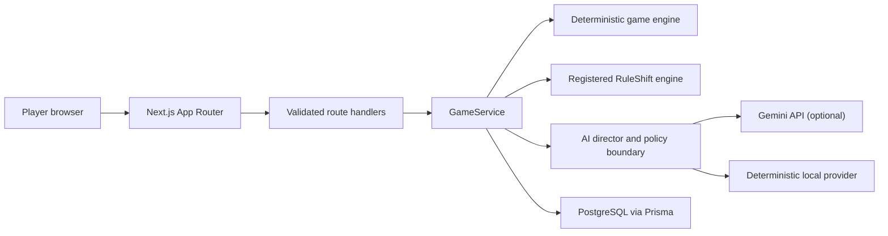
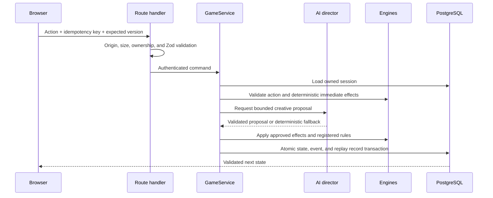
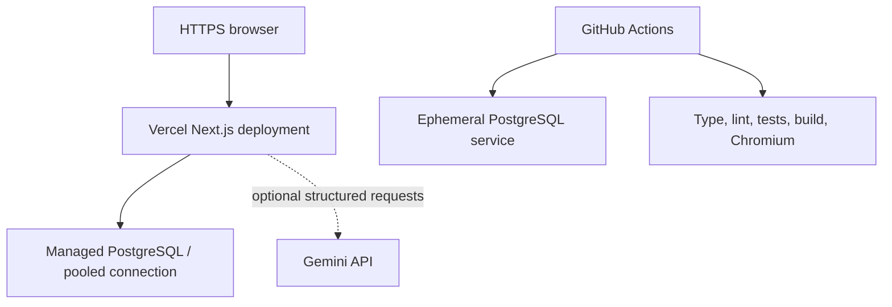

# RuleShift AI architecture

## System context



The browser is a renderer and interaction surface. It does not calculate
authoritative health, energy, score, inventory, objective, damage, rule duration,
victory, or defeat state.

## Layers and dependency direction

| Layer | Location | Responsibility |
| --- | --- | --- |
| Presentation | `src/app`, `src/components`, `src/features` | Routes, accessible UI, motion, audio, transport contracts |
| Application | `src/server/game` | Ownership, idempotency, version checks, AI orchestration, transactions |
| Domain | `src/domain/game`, `src/domain/rules` | Pure deterministic state transitions and registered rules |
| AI boundary | `src/server/ai` | Prompts, schemas, repair, policy, provider selection, fallback |
| Persistence | `src/server/repositories`, `prisma` | Atomic snapshots, normalized session data, migrations |
| HTTP/security | `src/server/http`, `src/server/auth` | Origin checks, bounded input, safe errors, cookies, rate limiting |

Dependencies point inward toward the domain. The domain imports no React,
Next.js, Prisma, browser storage, AI SDK, or environment configuration.

## Authoritative turn sequence



Duplicate idempotency keys replay the stored response. Stale state versions are
rejected. Transactions roll back if any authoritative persistence step fails.

## AI trust boundary

Player custom actions are quoted untrusted content. Gemini can generate prose,
dialogue, two-to-four choices, known rule proposals, bounded effects, item
descriptions, memory summaries, and final summaries. It cannot execute code,
select unknown rules, access secrets, write to PostgreSQL, or directly set
authoritative quantities or outcomes.

The processing chain is:

```text
provider text → JSON parse/repair → Zod schema → content policy
→ registered-rule validation → bounded deterministic conversion → engine
```

One retry and one repair attempt are bounded by a timeout. Every terminal
provider failure selects deterministic fallback data.

## Ownership and persistence

- A 256-bit anonymous owner token is generated server-side and stored in a
  secure HTTP-only, SameSite=Lax cookie.
- Only the SHA-256 owner-token hash is persisted or used in queries.
- Session reads, writes, results, and result images require matching ownership.
- PostgreSQL stores the current snapshot, normalized inventory/NPC/rule state,
  before/after event snapshots, state version, idempotency key, and timestamps.
- A unique session/turn constraint and serializable transaction protect state
  integrity under concurrent requests.

## Deployment topology



Vercel is the prepared target, not a hard dependency. No `vercel.json` is
required because the native Next.js adapter supports every route in this
repository and the AI director timeout remains below normal function limits.

## Health, logging, and observability

`GET /api/health` performs a bounded PostgreSQL readiness probe and reports only
`available` or `unavailable` plus deterministic-fallback readiness. It never
returns connection details, credentials, model names, prompts, or player data.

Application diagnostics log error classifications only. Recommended platform
monitoring covers health status, HTTP 5xx/429 counts, function duration, database
connections/latency, provider fallback rate, and completed-session rate. A
third-party observability SDK is intentionally not included in the MVP.

## Operational trade-offs

- The in-memory rate limiter is per serverless instance. Idempotency, ownership,
  origin checks, and provider timeouts still apply, but a distributed limiter or
  platform WAF rule is required for stronger abuse protection.
- Anonymous ownership avoids collecting identity data but cannot recover a
  session after its cookie is deleted.
- Result images stay private rather than introducing public share tokens.
- The database is mandatory for persisted play; Gemini is optional.
